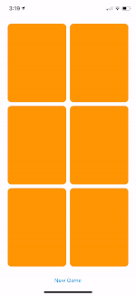

# Stanford SwiftUI Apps
Exploring the possibilities of app development using SwiftUI based on the lectures provided by Stanford University

---

### Lectures

I followed along with lectures provided through Stanford University.  
Those lectures can be found here: [Stanford: CS193p - Developing Apps for iOS](https://cs193p.sites.stanford.edu).  
A link to the youtube playlist for the video lectures can be found here: [Stanford CS193p iPhone Application Development Spring 2020](https://www.youtube.com/playlist?list=PLpGHT1n4-mAtTj9oywMWoBx0dCGd51_yG).

---
### Icons
To make an icon I used an app called [Vectornator Pro](https://apps.apple.com/us/app/vectornator-pro-vector-art/id1470168007?mt=12) on the Mac App Store.  
In order to turn the individual app icon into the different sizes needed for various Apple/Android devices I used the website [App Icon Maker - Resize App Icon to all sizes for iOS/Android store](https://appiconmaker.co/)

---

As additional lectures are released I plan on updating my app.
